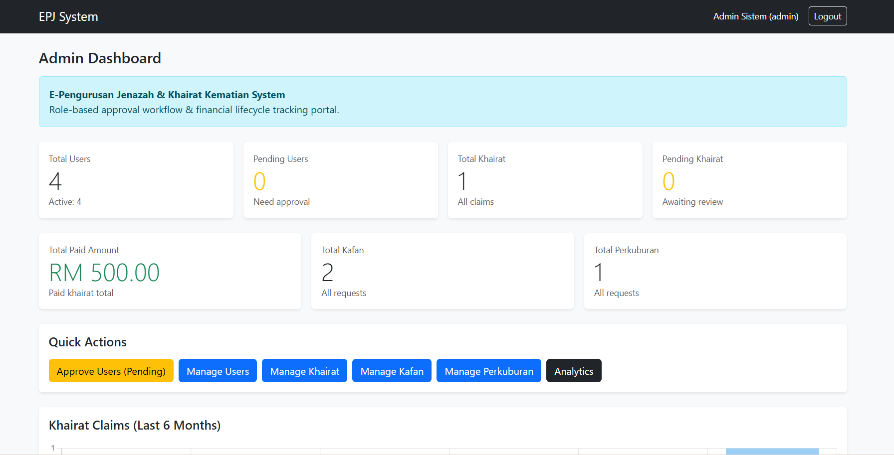
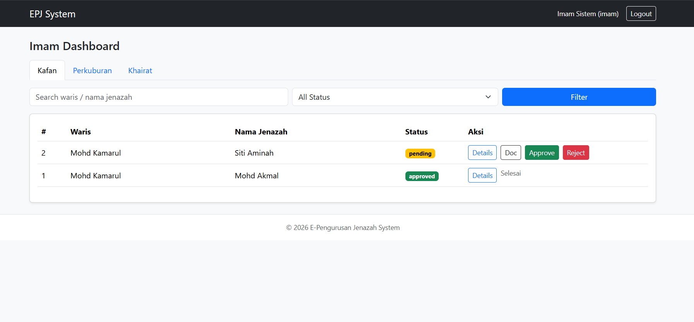

# E-Pengurusan Jenazah & Khairat Kematian System

A role-based administrative management system developed to digitize funeral service coordination and khairat claim processing.

---

## 🚀 Overview

This system was developed to replace manual administrative workflows with a structured digital platform. It supports multi-level approval processes, secure document verification, financial lifecycle tracking, and real-time monitoring via dashboard analytics.

The system simulates a real-world internal administrative portal with strict role-based access control.

---

## 📈 System Highlights

- 3 User Roles
- 10+ Modular Pages
- Full CRUD Operations
- Approval Workflow Simulation
- Financial Tracking System
- Analytics Dashboard

## 👥 User Roles

### 🔹 Waris (User)

- Register with IC document upload (Pending approval)
- Submit Kafan request
- Submit Perkuburan request
- Submit Khairat claim
- Track request status
- Download invoice
- Download receipt (after payment)

### 🔹 Imam

- Review incoming requests
- Search & filter submissions
- Verify uploaded documents
- Approve or reject requests

### 🔹 Admin

- Approve new user registrations
- Manage all users
- Monitor service requests
- Manage khairat claims
- Mark approved claims as paid
- Auto-generate receipt numbers
- View KPI dashboard & analytics

---

## 🔄 System Workflow

1. User registers and uploads IC → Status: Pending
2. Admin verifies and activates account
3. User submits service/khairat request
4. Imam reviews and approves/rejects
5. Admin marks khairat as Paid
6. System generates receipt automatically

---

## 📊 Key Features

- Role-Based Access Control (RBAC)
- Multi-level approval workflow
- Secure document upload & controlled file access
- Financial lifecycle tracking (Pending → Approved → Paid)
- Automated invoice and receipt generation
- Search, filter, pagination across modules
- KPI Dashboard monitoring
- Monthly analytics using Chart.js

---

## 🛠 Tech Stack

- PHP (Modular Architecture)
- MySQL
- Bootstrap 5
- JavaScript
- Chart.js

---

## 🏗 Project Structure

epj/
│
├── app/
│ ├── config/
│ ├── middleware/
│ ├── helpers/
│ └── views/
│
├── modules/
│ ├── admin/
│ ├── imam/
│ └── user/
│
├── public/
├── uploads/ (ignored)
└── database_schema.sql

---

## 📷 Screenshots

### Admin Dashboard

### Imam Dashboard

### User Dashboard

---

## ⚙ Installation Guide

1. Clone the repository
2. Import `database_schema.sql` into MySQL
3. Rename `app/config/db.example.php` to `db.php`
4. Configure your database credentials
5. Run using XAMPP / Apache

---

## 💡 What I Learned

- Designing multi-level approval workflows
- Implementing role-based access control (RBAC)
- Handling secure file uploads and controlled file serving
- Managing financial lifecycle state transitions
- Building KPI dashboards and analytics using Chart.js
- Structuring modular PHP applications

---

## 📌 Author

Nurul Fatihah Binti Mohd Zahari  
Bachelor of Information Technology (Hons)
